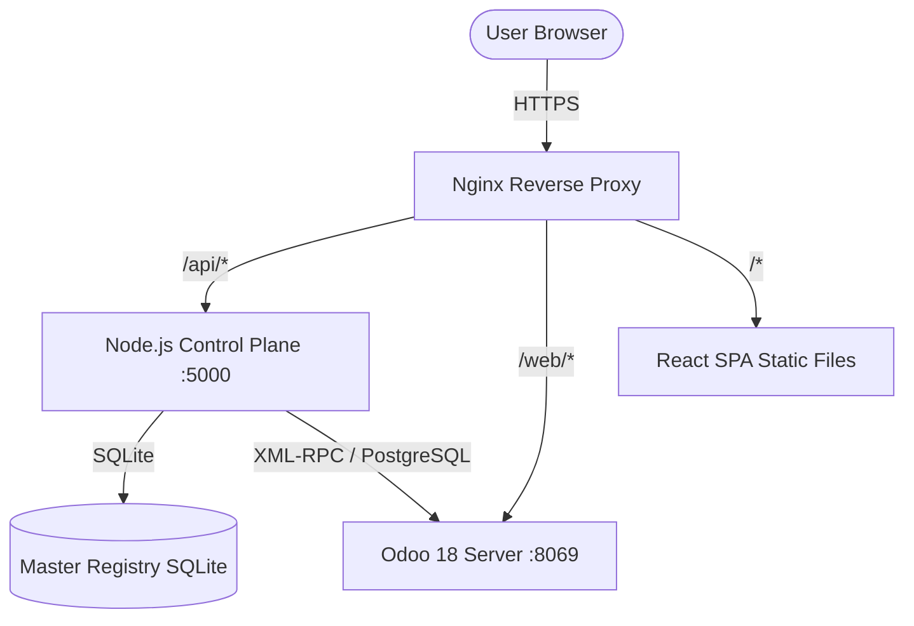

# BIZOPEASE — COMPLETE ARCHITECTURE & HANDOVER DOCUMENT
> Last updated: June 14, 2026 | Deployment: Production Active

---

## 1. WHAT THIS PROJECT IS & ARCHITECTURE OVERVIEW

BizOpease is a multi-tenant Software-as-a-Service (SaaS) portal built on top of Odoo 18 Community Edition. The system consists of three architectural layers:



### 1.1 The React Single Page Application (SPA)
* **Tech Stack**: React 18, TypeScript 5, Vite 5, Tailwind CSS 3, React Router v6.
* **Role**: Serve as a high-performance, premium user interface that completely replaces the native Odoo backend UI.
* **Authentication**: Authenticates via a 2-step unified login screen. It first resolves the workspace from the email address through the SaaS control-plane API (`/api/auth/find-workspace`), then authenticates directly against Odoo.
* **Path-Based Workspaces**: All business routes are nested under the workspace slug prefix (e.g., `bizopease.robifel.in/robifel/dashboard`).
* **Route Guards & Authorization**: Users are automatically restricted from accessing `/:workspace` pages unless their authenticated Odoo session matches the requested database slug.

### 1.2 The SaaS Control Plane
* **Tech Stack**: Node.js, Express, SQLite (`sqlite3`), PM2.
* **Role**: Manage workspace database provisioning, payments, and superadmin configurations.
* **Database**: Runs on a local SQLite master database registry (`master.db`) to record tenant workspace mappings, plan options, payment histories, and system configurations.

### 1.3 Nginx Gateway & Proxying
* **Routing Strategy**: Directs traffic based on path prefixes:
  * `/api/` -> Proxied to the Node.js Express Control Plane (Port `5000`).
  * `/web/` -> Proxied directly to Odoo 18 (Port `8069`) for direct cookie-based RPC communication.
  * `/download/` -> Serves static Android APK downloads (`BizOpease.apk`).
  * `/superadmin` -> Serves the Superadmin dashboard panel.
  * `/` (and all catch-all routes) -> Serves the built React SPA static assets from `/var/www/bizopease/`.

---

## 2. INFRASTRUCTURE & CREDENTIALS

### 2.1 Server Details
* **IP Address**: `82.180.144.9`
* **SSH Details**: `root@82.180.144.9`
* **Services**:
  * **Odoo 18**: running as systemd service `odoo` on port `8069`
  * **SaaS Control Plane**: running via PM2 under process name `bizopease-saas` on port `5000`
  * **Nginx**: reverse-proxying traffic with Let's Encrypt SSL.

### 2.2 Local & Remote Directories
* **Local Project Root**: `C:\Users\Sachi\.gemini\antigravity-ide\scratch\robifel_portal`
* **SaaS Control Plane Path (Server)**: `/var/www/bizopease-saas/`
* **React SPA Path (Server)**: `/var/www/bizopease/`
* **Odoo Custom Addons Path (Server)**: `/opt/odoo/custom_addons/`

---

## 3. CUSTOM ADDONS (Server: `/opt/odoo/custom_addons/`)

Six custom addons are installed on the server. The primary one is `flipkart_os`.

### 3a. `flipkart_os` — Business OS (PRIMARY ADDON)
**Manifest**: Version 18.0.3.5.0, depends on base, web, mail, stock, mrp, purchase, purchase_stock

#### Model: `flipkart.account`
```python
name = Char(required, unique)
is_active = Boolean(default True)
```
Represents Flipkart seller accounts (Robifel, Roxxcart).

#### Model: `flipkart.warehouse.config`
```python
name = Char(required)
account_id = Many2one('flipkart.account', required)
backend_warehouse_id = Many2one('stock.warehouse')
flipkart_warehouse_code = Char(required)  # From FBF CSV header
transit_days = Integer(default 3)
is_active = Boolean(default True)
```

#### Model: `flipkart.fbf.stock`
All fields from the FBF CSV upload:
```python
account_id, warehouse_config_id, product_id, sku, fsn, title, brand, selling_price
qty_live, sales_7d, sales_14d, sales_30d, sales_60d, sales_90d
b2b_scheduled, transfers_scheduled, b2b_shipped, transfers_shipped
b2b_receiving, transfers_receiving, reserved_orders, reserved_internal
returns_processing, orders_to_dispatch, recalls_to_dispatch
damaged, qc_reject, catalog_reject, returns_reject, seller_return_reject, miscellaneous
length_cm, breadth_cm, height_cm, weight_kg, fulfilment_type, f_assured
```

#### Model: `flipkart.fbf.replenishment`
```python
account_id, warehouse_config_id, product_id, sku, fsn
selected = Boolean  # Toggle for consignment creation
# Inputs:
fbf_stock, sales_7d, sales_14d, in_transit, transit_days
target_cover_days(default 14), critical_days(default 7), moderate_days(default 21)
# Computed (stored):
daily_sales, qty_to_send, days_cover_after
urgency = Selection(['critical','moderate','healthy'])
urgency_sequence = Integer
```
**Wizard** `flipkart.fbf.replenishment.generate`:
* Field: `account_id` (Many2one flipkart.account)
* Method: `action_generate` — deletes old records for account, regenerates from FBF stock
* **Portal usage**: `createRecord('flipkart.fbf.replenishment.generate', {account_id: N})` then `odooCall(..., 'action_generate', [[wizardId]], {})`

#### Model: `flipkart.supplier.reorder`
```python
product_id, sku
# Stock:
physical_stock, total_fbf_stock, incoming_qty, next_po_arrival_date
# Sales:
daily_avg_sales
# Config:
lead_time_days(default 60), target_cover_days(default 30), order_cycle_days(default 30)
# Computed (stored):
total_available, pipeline_lowest_days, days_in_hand, stockout_date
order_now_qty, next_order_date, next_order_qty, reorder_trigger_date, reorder_qty
action_required = Boolean  # True when order needs to be placed
urgency = Selection(['critical','moderate','healthy'])
urgency_sequence = Integer
```
**Wizard** `flipkart.supplier.reorder.generate`:
* Field: `warehouse_id` (Many2one stock.warehouse)
* Method: `action_generate`

#### Model: `flipkart.consignment`
```python
name = Char(sequence, copy=False)
account = Selection([('robifel','Robifel'),('roxxcart','Roxxcart')], required)
warehouse_id = Many2one('stock.warehouse', required)
pickup_date = Date(required, default today)
state = Selection(['draft','rtd','picked_up','inwarded','rejected'])
csv_file = Binary, csv_file_name = Char
line_ids = One2many('flipkart.consignment.line', 'consignment_id')
box_ids = One2many('flipkart.box', 'consignment_id')
picking_id = Many2one('stock.picking', readonly)
```
**Methods**:
* `action_parse_csv` — parse uploaded CSV, create consignment lines
* `action_generate_barcodes` — generate barcode PDF for all lines
* `action_mark_rtd` — draft → rtd
* `action_mark_picked_up` — rtd → picked_up (creates stock delivery if setting enabled)
* `action_mark_inwarded` — picked_up → inwarded
* `action_mark_rejected` — any → rejected
* `action_print_all_box_packing_slips_qz` — print all box packing slips via QZ Tray

#### Model: `flipkart.consignment.line`
```python
consignment_id, product_name, fsn, sku_id, brand, size, style_code, color
isbn, model_id, quantity_sent, quantity_received
box_line_ids = One2many('flipkart.box.line', 'consignment_line_id')
qty_allocated = Integer(computed, stored)  # sum of box line quantities
qty_remaining = Integer(computed, stored)  # quantity_sent - qty_allocated
inwarded_to_store, qc_fail, qc_in_progress, qc_passed = Char
cost_price, length_cm, breadth_cm, height_cm, weight_kg = Float
```

#### Model: `flipkart.box`
```python
name = Char(required, default 'New Box')
consignment_id = Many2one('flipkart.consignment', ondelete='cascade')
line_ids = One2many('flipkart.box.line', 'box_id')
length, breadth, height, weight = Float  # dimensions
```
**Methods**:
* `action_print_packing_slip` — returns PDF binary attachment
* `action_print_packing_slip_qz` — returns TSPL string for QZ Tray direct print
* `action_add_all_pending` — adds all consignment lines with qty_remaining > 0

#### Model: `flipkart.box.line`
```python
box_id = Many2one('flipkart.box', ondelete='cascade')
consignment_line_id = Many2one('flipkart.consignment.line')
quantity = Integer
```

#### Model: `flipkart.return.management`
```python
account_id, return_id, tracking_id (indexed), fsn, sku, product_id, quantity
return_requested_date, return_type, return_reason
state = Selection(['draft','scanned','processed','rejected','cancelled'])
stock_move_ids = One2many('stock.move', 'return_id')
picking_id = Many2one('stock.picking')
```
**Methods**: `action_confirm_inward` (bulk), `action_reject`

**Wizard** `flipkart.return.upload`:
* Fields: `file_data` (Binary), `file_name`
* Method: `action_import`

**Wizard** `flipkart.return.scan.wizard`:
* Fields: `tracking_id`, `product_name` (computed), `return_record_id`
* Methods: `action_confirm_and_next`, `action_reject_and_next`
* **Portal usage**:
  ```typescript
  const wizardId = await createRecord('flipkart.return.scan.wizard', {tracking_id: '...'});
  const wizard = await searchRead('flipkart.return.scan.wizard', {domain: [['id','=',wizardId]], fields: ['product_name','return_record_id']});
  // confirm: odooCall('flipkart.return.scan.wizard', 'action_confirm_and_next', [[wizardId]], {})
  // reject:  odooCall('flipkart.return.scan.wizard', 'action_reject_and_next', [[wizardId]], {})
  ```

**Wizard** `flipkart.daily.order.upload`:
* Fields: `file_data` (Binary), `file_name`
* Method: `action_import` — parses CSV, creates sale orders with BOM-exploded stock moves

**Wizard** `flipkart.listing.upload`:
* Fields: `xls_file` (Binary), `xls_file_name`
* Method: `action_upload` — parses XLS, upserts `flipkart.listing` records

**Wizard** `flipkart.upload.wizard` (FBF inventory + sales CSV):
* Fields: `upload_type` (fbf_inventory/sales_data), `account_id`, `sales_start_date`, `sales_end_date`, `file_data`, `file_name`
* Method: `action_upload`

#### Model: `flipkart.listing` (Master Listing)
```python
fsn = Char(required, unique, indexed)
sku, name, category, mrp, selling_price = Char/Float
length_cm, breadth_cm, height_cm, weight_kg = Float
manufacturer, packer = Text
```

#### Model: `sr.multi.barcode` (FSN/Barcode mapping)
```python
name = Char  # barcode or FSN
product_id = Many2one('product.product')
barcode = Char
```

#### Model: `flipkart.sales.dashboard`
```python
account_id, partner_id, sale_order_line_id, order_number, order_date
product_id, sku_id, category, brand, vertical, fulfillment_type, location_id
gross_units, gmv, cancellation_units, cancel_amount, return_units, return_amount
final_sale_units, final_sale_amount
```

#### Model: `flipkart.bill.payment.vendor`
```python
name = Char(required)
deduction_percent = Float(default 0.0)
phone, notes = Char/Text
transaction_ids = One2many('flipkart.bill.payment.transaction', 'vendor_id')
ledger_ids = One2many('flipkart.bill.vendor.ledger', 'vendor_id')
balance = Float(computed, not stored)  # transfer - deduction - cash_received - agent_paid
```
Methods: `action_view_transactions`, `action_view_ledger`

#### Model: `flipkart.bill.payment.transaction`
```python
vendor_id = Many2one('flipkart.bill.payment.vendor')
date, name, note = Date/Char/Text
transfer_amount, deduction_amount = Float
payment_received = Boolean
actual_cash_received, expected_cash_amount = Float
agent_payment_source = Selection  # 'vendor' or other
agent_payment_amount = Float
received_by_id = Many2one('flipkart.money.associate')
```

#### Model: `flipkart.money.associate`
```python
name = Char(required)
phone, notes = Char/Text
transaction_ids = One2many('flipkart.bill.payment.transaction', 'received_by_id')
ledger_ids = One2many('flipkart.associate.ledger', 'associate_id')
balance = Float(computed, stored)  # sum of credits - debits
```

#### Model: `flipkart.associate.ledger`
```python
associate_id = Many2one('flipkart.money.associate')
date, entry_type = Date/Selection
# entry_type values: cash_received, transfer_in, agent_payment, expense, transfer_out
amount, reference, note = Float/Char/Text
```

#### Model: `flipkart.carrying.agent`
```python
name = Char(required)
contact_details = Text
outstanding_balance = Float(computed, stored)  # from ledger entries
ledger_ids = One2many('flipkart.agent.ledger', 'agent_id')
```

#### Model: `flipkart.agent.ledger`
```python
agent_id = Many2one('flipkart.carrying.agent')
date = Date(required, default today)
entry_type = Selection([('bill','Purchase Bill (+)'),('payment','Outbound Payment (-)'),('adjustment','Manual Adjustment')])
amount_inr = Float(required)
reference, notes = Char/Text
# Computed non-stored:
debit = Float  # amount_inr if bill/adjustment
credit = Float  # amount_inr if payment
balance = Float  # debit - credit
```

#### Model: `flipkart.unified.ledger.line` (SQL view, read-only)
Combines data from 4 sources:
* `account.move.line` (partner transactions, posted, receivable/payable accounts)
* `flipkart.bill.payment.transaction` (vendor bill/payments)
* `flipkart.associate.ledger` (associate transactions)
* `flipkart.agent.ledger` (agent transactions)

Fields:
```python
date, party_id(Integer), party_type(Selection: partner/vendor/associate/agent)
party_name, source_model, source_record_id, entry_type
reference, details, debit, credit, balance
```

#### Model: `flipkart.unified.ledger.summary` (SQL view, read-only)
```python
# Same data as above but aggregated per party
party_type, party_name, party_id, debit, credit, balance
```

**Create Entry Wizards**:
* `flipkart.bill.payment.entry.wizard`:
  * Fields: `entry_type` (bank_transfer/receive_payment/agent_payment/expense/associate_transfer), `vendor_id`, `agent_id`, `associate_id`, `amount`, `date`, `reference`, `note`, `transaction_id`
  * Method: `action_apply`
* `business.manual.entry.wizard`:
  * Fields: `partner_id`, `amount`, `debit_account_id`, `credit_account_id`, `date`, `reference`, `note`
  * Method: `action_post_entry`

#### Settings (`res.config.settings` inherited)
* **Load**: `odooCall('res.config.settings', 'get_values', [], {})`
* **Save**: `createRecord('res.config.settings', vals)` → `odooCall('res.config.settings', 'execute', [[id]], {})`

| Field | Config param key | Default |
|-------|-----------------|---------|
| `flipkart_stock_deduction_enabled` | `flipkart_os.stock_deduction_enabled` | False |
| `flipkart_returns_stock_move_enabled` | `flipkart_os.returns_stock_move_enabled` | False |
| `flipkart_consignment_stock_move_enabled` | `flipkart_os.consignment_stock_move_enabled` | True |
| `flipkart_dead_stock_sales_days` | `flipkart_os.dead_stock_sales_days` | 30 |
| `flipkart_fbf_target_cover_days` | `flipkart_os.fbf_target_cover_days` | 14 |
| `flipkart_fbf_critical_days` | `flipkart_os.fbf_critical_days` | 7 |
| `flipkart_fbf_moderate_days` | `flipkart_os.fbf_moderate_days` | 21 |
| `flipkart_supplier_sales_days` | `flipkart_os.supplier_sales_days` | 30 |
| `flipkart_supplier_lead_time_days` | `flipkart_os.supplier_lead_time_days` | 65 |
| `flipkart_supplier_target_cover_days` | `flipkart_os.supplier_target_cover_days` | 30 |
| `flipkart_supplier_order_cycle_days` | `flipkart_os.supplier_order_cycle_days` | 30 |
| `flipkart_ai_enabled` | `flipkart_os.ai_enabled` | False |
| `flipkart_ai_provider_name` | `flipkart_os.ai_provider_name` | 'OpenAI-compatible' |
| `flipkart_ai_api_url` | `flipkart_os.ai_api_url` | (URL) |
| `flipkart_ai_model` | `flipkart_os.ai_model` | 'minimax-m2.5-free' |
| `flipkart_ai_api_key` | `flipkart_os.ai_api_key` | (empty) |
| `flipkart_ai_api_format` | `flipkart_os.ai_api_format` | 'openai_chat' |
| `flipkart_ai_timeout` | `flipkart_os.ai_timeout` | 60 |
| `flipkart_ai_temperature` | `flipkart_os.ai_temperature` | 0.2 |

---

### 3b. `b2b_os` — B2B Operations

#### Model: `b2b.ledger` (SQL view)
```python
date, partner_id, move_id, name, ref
debit, credit, balance, amount_currency, currency_id
account_id, company_id
```
Source: `account_move_line` where `account_type IN ('asset_receivable','liability_payable')` and `move.state = 'posted'`

Special: `unlink()` cascades to delete the source journal entry (intentional B2B workflow)

#### Model: `b2b.ledger.summary` (SQL view)
```python
partner_id, debit, credit, balance
```
Method: `action_open_ledger_details` — opens B2B ledger filtered for partner

---

## 4. ODOO API — HOW THE PORTAL CALLS ODOO

All API calls go through `src/services/odoo.ts`. Never bypass this file.

### Core functions:
```typescript
// Search and read records — ALWAYS use limit: 0 for no limit
searchRead<T>(model: string, opts: {
  fields: string[],
  domain?: any[],      // Odoo domain: [['field','operator','value'], ...]
  limit?: number,      // ALWAYS 0 (no limit)
  order?: string,      // e.g. 'date desc'
  offset?: number
}): Promise<T[]>

// Create a record — returns integer ID
createRecord(model: string, values: Record<string, any>): Promise<number>

// Update records
writeRecord(model: string, ids: number[], values: Record<string, any>): Promise<boolean>

// Call any model method
odooCall<T>(model: string, method: string, args: any[], kwargs: {}): Promise<T>
// Instance method (on a record):   args = [[recordId]]
// Model-level method:               args = []
```

### Wizard pattern (CRITICAL — must always follow this):
```typescript
// 1. Create wizard record
const wizardId = await createRecord('some.wizard.model', { field1: val1 });
// 2. Call action method on it
const result = await odooCall('some.wizard.model', 'action_method_name', [[wizardId]], {});
```

---

## 5. APP DIRECTORY & ROUTING INVENTORY

All app routes are defined in `src/App.tsx` and nested under `/:workspace`:

| Target Path | Component File | Description |
|-------------|----------------|-------------|
| `/login` | `src/pages/Login.tsx` | 2-step unified workspace login page |
| `/:workspace/dashboard` | `src/components/modules/Dashboard.tsx` | Business KPIs and graphical summary |
| `/:workspace/tasks` | `src/components/modules/Tasks/Tasks.tsx` | Employee workspace task lists |
| `/:workspace/sales/orders` | `src/components/modules/Sales/SalesOrders.tsx` | Orders list and validation |
| `/:workspace/sales/quotations` | `src/components/modules/Sales/Quotations.tsx` | Customer quotation details |
| `/:workspace/sales/customers` | `src/components/modules/Sales/Customers.tsx` | res.partner customer list & B2B settings |
| `/:workspace/purchase/orders` | `src/components/modules/Purchase/PurchaseOrders.tsx` | Purchase orders management |
| `/:workspace/purchase/rfq` | `src/components/modules/Purchase/Rfq.tsx` | Requests for Quotation |
| `/:workspace/purchase/vendors` | `src/components/modules/Purchase/Vendors.tsx` | res.partner vendors registry |
| `/:workspace/purchase/price-list` | `src/components/modules/Purchase/VendorPriceList.tsx` | product.supplierinfo pricing master |
| `/:workspace/inventory/products` | `src/components/modules/Inventory/Products.tsx` | product.product stock items |
| `/:workspace/inventory/transfers` | `src/components/modules/Inventory/Transfers.tsx` | stock.picking warehouse transfers |
| `/:workspace/inventory/stock` | `src/components/modules/Inventory/Stock.tsx` | stock.quant inventory levels |
| `/:workspace/inventory/reordering` | `src/components/modules/Inventory/Reordering.tsx` | stock.warehouse.orderpoint rules |
| `/:workspace/accounting/invoices` | `src/components/modules/Accounting/Invoices.tsx` | Customer invoices & payments |
| `/:workspace/accounting/bills` | `src/components/modules/Accounting/Bills.tsx` | Vendor bills & payment registering |
| `/:workspace/accounting/journal` | `src/components/modules/Accounting/Journal.tsx` | General journal entries |
| `/:workspace/accounting/reports` | `src/components/modules/Accounting/Reports.tsx` | Financial statement wizards |
| `/:workspace/crm/pipeline` | `src/components/modules/CRM/Pipeline.tsx` | Sales opportunity boards |
| `/:workspace/crm/leads` | `src/components/modules/CRM/Leads.tsx` | Incoming sales leads |
| `/:workspace/hr/employees` | `src/components/modules/HR/Employees.tsx` | Employee list & detail views |
| `/:workspace/hr/leaves` | `src/components/modules/HR/Leaves.tsx` | Time-off logs |
| `/:workspace/hr/attendance` | `src/components/modules/HR/Attendance.tsx` | Check-in/out timestamps |
| `/:workspace/hr/salary` | `src/components/modules/HR/Salary.tsx` | Payroll listings |
| `/:workspace/hr/live-map` | `src/components/modules/HR/LiveMap.tsx` | Active employee maps |
| `/:workspace/hr/settings` | `src/components/modules/HR/HrSettings.tsx` | HR rules configuration |
| `/:workspace/hr/kiosk` | `src/components/modules/HR/Kiosk.tsx` | Attendance check-in kiosk screen |
| `/:workspace/flipkart/fbf` | `src/components/modules/FlipkartOS/FbfReplenishment.tsx` | Replenishments & consignments |
| `/:workspace/flipkart/fbf-stock` | `src/components/modules/FlipkartOS/FbfStock.tsx` | Live stock levels |
| `/:workspace/flipkart/scanner` | `src/components/modules/FlipkartOS/DailyOrderScanner.tsx` | Daily order scans |
| `/:workspace/flipkart/supplier` | `src/components/modules/FlipkartOS/SupplierReorders.tsx` | Auto-reordering parameters |
| `/:workspace/flipkart/deadstock` | `src/components/modules/FlipkartOS/DeadStockView.tsx` | Dead inventory monitoring |
| `/:workspace/flipkart/consignments` | `src/components/modules/FlipkartOS/ConsignmentManager.tsx` | Consignment boxes & barcodes |
| `/:workspace/flipkart/returns` | `src/components/modules/FlipkartOS/ReturnsManagement.tsx` | Flipkart customer returns |
| `/:workspace/flipkart/sales-dashboard` | `src/components/modules/FlipkartOS/SalesDashboard.tsx` | E-commerce sales KPIs |
| `/:workspace/flipkart/valuation` | `src/components/modules/FlipkartOS/StockValuation.tsx` | Inventory dollar-valuation |
| `/:workspace/flipkart/listings` | `src/components/modules/FlipkartOS/Listings.tsx` | Master FSN mappings |
| `/:workspace/flipkart/upload` | `src/components/modules/FlipkartOS/UploadCenter.tsx` | CSV parsing wizards |
| `/:workspace/flipkart/setup` | `src/components/modules/FlipkartOS/FlipkartSetup.tsx` | System configurations |
| `/:workspace/flipkart/ledger` | `src/components/modules/FlipkartOS/UnifiedLedger.tsx` | Unified ledger lines |
| `/:workspace/flipkart/quick-sale` | `src/components/modules/FlipkartOS/QuickSaleOrder.tsx` | Fast sales input form |
| `/:workspace/flipkart/create-entry` | `src/components/modules/FlipkartOS/CreateEntry.tsx` | Wizard transaction inputs |
| `/:workspace/b2b/orders` | `src/components/modules/B2B/B2BOrders.tsx` | Wholesale account orders |
| `/:workspace/b2b/ledger` | `src/components/modules/B2B/B2BLedger.tsx` | B2B partner statements |
| `/:workspace/settlements/studio` | `src/components/modules/Settlements/SettlementStudio.tsx` | Multi-party settlements console |
| `/:workspace/settlements/expenses` | `src/components/modules/Settlements/ExpenseManager.tsx` | Settlement expenses log |
| `/:workspace/settings/general` | `src/components/modules/Settings/GeneralSettings.tsx` | Portal configuration values |
| `/:workspace/settings/profile` | `src/components/modules/Settings/Profile.tsx` | User profile adjustments |

---

## 6. COMPILE, TEST, & DEPLOY WORKFLOW

### 6.1 Building Locally
Ensure the local build is syntax-free and ready for Vite packaging:
```powershell
npm run build
```
This performs TypeScript compilation (`tsc`) and compiles static outputs to `dist/`.

### 6.2 Deploying Built Assets
1. Copy the built frontend files to the target web folder on the remote host:
   ```powershell
   scp -r C:\Users\Sachi\.gemini\antigravity-ide\scratch\robifel_portal\dist\* root@82.180.144.9:/var/www/bizopease/
   ```
2. Reset file ownership and path permissions so the web daemon can serve them:
   ```powershell
   ssh root@82.180.144.9 "chown -R www-data:www-data /var/www/bizopease && chmod -R 755 /var/www/bizopease"
   ```

### 6.3 Deploying Control Plane Changes
If you modify the Express server code under `/control-plane/`:
1. Upload the files to the control-plane location:
   ```powershell
   scp C:\Users\Sachi\.gemini\antigravity-ide\scratch\robifel_portal\control-plane\* root@82.180.144.9:/var/www/bizopease-saas/
   ```
2. Reload the daemon to apply changes:
   ```powershell
   ssh root@82.180.144.9 "pm2 restart bizopease-saas"
   ```

---

## 7. CRITICAL CODING & DESIGN RULE
> [!IMPORTANT]
> **NEVER use non-ASCII characters in any TSX file.** The build pipeline uses esbuild which rejects curly quotes (Mojibake), double-encoded symbols, and Unicode signs (e.g. Indian Rupee `₹`).
> * Use `Rs.` instead of `₹`.
> * Use standard dashes `--` instead of em-dashes `—`.
> * Use triple dots `...` instead of ellipses `…`.
